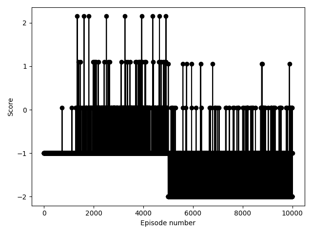

# Simplified RimWorld Env for RL

Very simple implementation of RimWorld's mechanics in a gym env to train a reinforcement learning algorithm

* A single deep Q learning algo learns how to kill enemies
* The friends are allowed instant movement on a 10 by 10 grid
* New enemy wave is spawned each time the last one is fully killed
* At the start waves are 1 enemy, at the half mark it goes to 2
* At the start the AI controls 1 actor, at the half mark it goes to 2
* Shots are instants
* There is a single box that provides cover

Rewards:
* 1 per kill
* -1 per actor that is killed
* -0.0000002 for moving to an occupied spot
* -0.0000002 for shooting an empty spot
* -0.05 for not doing anything for 10 consecutive steps
* +0.05 for killing all enemies in a round

  

## Graph

The half point decrease in scores is because the amount of initial enemies and actors are upped.

Thanks:
* [seungeunrho/minimalRL](https://github.com/seungeunrho/minimalRL)
* [Learning to be a Bot: Reinforcement Learning in Shooter Games (Michelle McPartland and Marcus Gallagher, 2008)](https://www.aaai.org/Papers/AIIDE/2008/AIIDE08-013.pdf)
----
