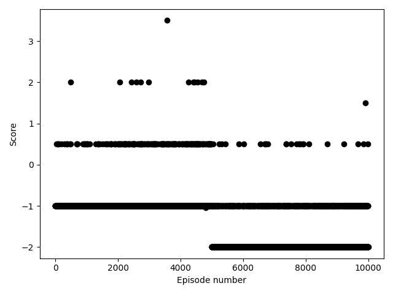

# Simplified RimWorld Env for RL

Very simple implementation of RimWorld's mechanics in a gym env to train a reinforcement learning algorithm

  

## Graph

Thanks:
* [seungeunrho/minimalRL](https://github.com/seungeunrho/minimalRL)
* [Learning to be a Bot: Reinforcement Learning in Shooter Games (Michelle McPartland and Marcus Gallagher, 2008)](https://www.aaai.org/Papers/AIIDE/2008/AIIDE08-013.pdf)
----
